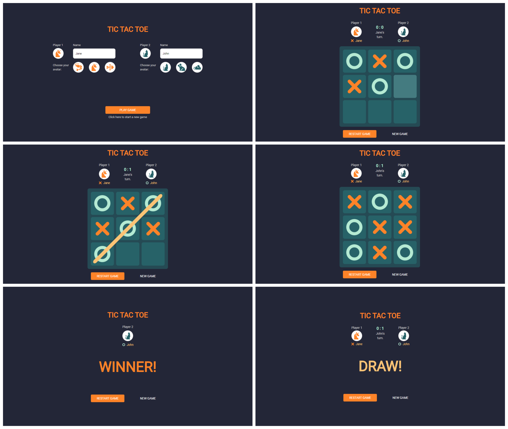

# TIC-TAC-TOE
> A simple TicTacToe game for two players build in vanilla JavaScript, along with HTML5 and CSS3.

## Table of contents
* [General info](#general-info)
* [Screenshots](#screenshots)
* [Technologies](#technologies)
* [Demo](#demo)
* [How to play](#how-to-play)
* [Features](#features)
* [Status](#status)
* [Copyrights](#copyrights)
* [Authors](#authors)

## General info
The purpose of the project was a group work during the CodersCamp bootcamp. Our motivation is to build the very first game and have fun!

## Screenshots

## Technologies
* HTML5
* CSS3
* JavaScript

## Demo
Demo version available [here](https://dariaka.github.io/OXGame/)
Have fun! :)

## How to play
Just kidding, everyone knows that, right? [Right?](https://www.youtube.com/watch?v=ub6FIPpojoI) ;)

## Features
What we managed to achive:
* Switching between start and board screen.
* Board fields lock after putting a sign on them.
* The game board locks itself after win or draw.
* Use Local Storage to information about last three games.
* Our app is responsive.
* It works and looks nice :)

Ideas on how to make our app even better:
* Add more sound effects and button to switch off/on sound.
* Playing against computer (AI)
* Animations

## Status
Project is: _finished_.

## Copyrights
All icons used in project as avatars are made by Freepik (come from https://www.flaticon.com/).
Audio files used in project come from http://soundbible.com/
* Mario_Jumping-Mike_Koenig-989896458.wav - recorded by Mike Koenig -  Attribution 3.0
* Jump-SoundBible.com-1007297584 - recorded by snottyboy -  Attribution 3.0
* Ta Da-SoundBible.com-1884170640 - recorded by Mike Koenig -  Attribution 3.0

## Authors
Created by CodersCamp's members under the supervision of [@Małgorzata Bousoltane](https://github.com/MalgoskaBou):
[@Ievgeniia Abdulina](https://github.com/IevgeniiaAbdulina)
[@Iwona](https://github.com/Crazysh8)
[@Daria Kawalec](https://github.com/dariaka)
[@Olimpia Kwiecień](https://github.com/kvviecien)
[@OMagdalena Szczech](https://github.com/magdalenaszczech)
[@Piotr Wolniak](https://github.com/PiotrWolniak)
